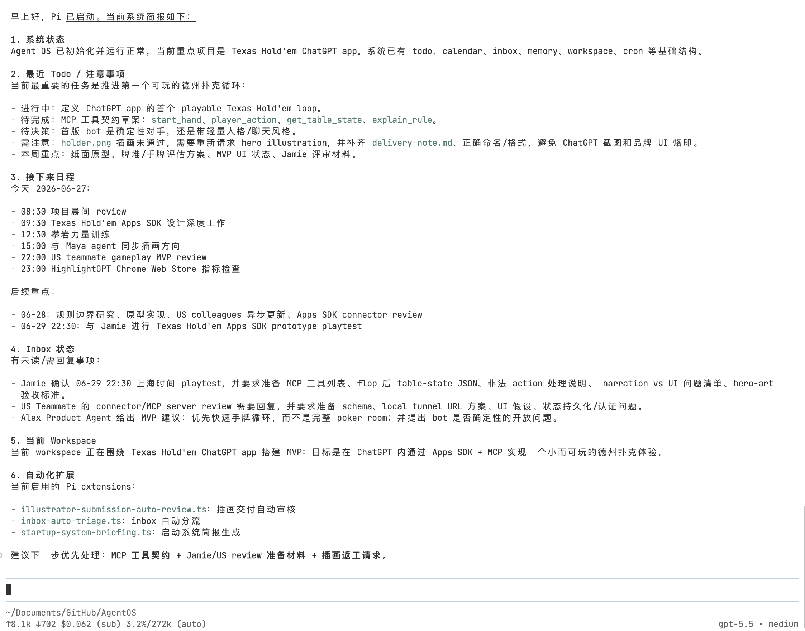

# AgentOS

AgentOS 是一个基于本地文件系统的 Agent OS Demo，用来验证能否把文件夹、文件、Markdown 规则和文件 diff 事件作为 Agent 的操作系统。

核心思路：OS 主对话负责全局个人助手能力，`os/workspace/projects/` 下的项目文件夹负责更专注的 coding-agent 工作。两者共享同一套文件系统状态。

当前实现基于 `@earendil-works/pi-coding-agent` 的纯 TUI 形态，用户在终端里通过 Pi 对话和命令与 AgentOS 交互，暂时没有 GUI 操作界面。



## 快速开始

环境要求：

- Node.js `>=22.19.0`
- npm

初始化时本机验证过的 Node 版本是 `v24.16.0`。

安装依赖：

```bash
npm install
```

启动 Pi 交互模式：

```bash
npm run pi
```

Pi 支持多个模型提供方。如果要使用已有订阅，启动 Pi 后运行：

```text
/login
```

也可以在 shell 环境变量中配置 provider API key 后再运行 Pi。

常用命令：

```bash
npm run pi -- --version
npm run pi -- --help
npm run pi
npm run pi:print -- "下一步应该做什么？"
```

## Agent OS 模型

`os/` 是这个项目的主要产品界面：

```text
os/
├── todo/          # 按日期组织的 Markdown 任务列表
├── calendar/      # 按日期组织的日程
├── inbox/         # 外部消息同步目录，每封邮件是带 metadata 的 Markdown 文件
├── collaboration/ # 人或其他 Agent 的共享协作空间
├── wiki/          # 沉淀后的项目知识库
├── memory/        # 关于个人的偏好、决策、观察和总结
├── profiles/      # 用户和协作者档案
├── workspace/     # Agent 工作时的项目目录
├── cron/          # 定时任务定义目录
└── dashboard/     # 面向用户的系统状态视图
```

**`os/workspace/` 下的子文件夹未来也会出现在桌面端中，作为独立的项目文件夹进行更专注的处理。**

预期工作流：

1. 外部输入先进入 `inbox/` 或 `collaboration/`。
2. Agent Harness 捕获文件 diff 事件，并把相关上下文发送给 Agent。
3. Agent 更新 `todo/`、`calendar/`、`wiki/`、`memory/`，或进入 `workspace/` 开始工作。
4. `dashboard/` 面向用户提供快速状态视图。

## 当前原型

当前 Demo 使用 `@earendil-works/pi-coding-agent` 实现，主要利用 Pi 足够灵活的 extension 机制。

仓库目前包含：

- 项目本地安装的 `@earendil-works/pi-coding-agent`
- 已初始化的 `os/` 文件系统版 Agent OS
- 静态 HTML 系统看板：`os/dashboard/index.html`
- 一个作为示例项目使用的 Texas Hold'em ChatGPT Apps SDK 工作区
- 模拟的 inbox、profiles、todo、calendar、wiki、memory、cron 和 collaboration 数据
- 三个 Pi extensions：启动简报、inbox 自动分拣、插画提交自动评审

大多数文件是 seed data、运行约定和自动化实验，还不是完整应用。

## 已实现的自动化链路

### 示例-Inbox 新邮件触发 Todo / Calendar 整理

扩展文件：

```text
.pi/extensions/inbox-auto-triage.ts
```

监听目录：

```text
os/inbox/**/*.md
```

当 `os/inbox/` 中新增 Markdown 邮件时，Pi 会收到邮件路径和内容，并判断是否需要更新 `os/todo/`、`os/calendar/`、`os/wiki/` 或 `os/memory/`。如果不需要动作，回复 `<|no_change|>`。

测试方式：

1. 启动 Pi：`npm run pi`
2. 在 `os/inbox/2026-06-27/` 中新增一封 `.md` 邮件。
3. 观察 Pi 是否触发处理流程，并按邮件内容更新相关 OS 文件。

### 示例-插画师提交作品后触发自动评审

扩展文件：

```text
.pi/extensions/illustrator-submission-auto-review.ts
```

监听目录：

```text
os/collaboration/illustrator-outsourcing-platform/tasks/*/submissions/
```

当前示例任务目录是：

```text
os/collaboration/illustrator-outsourcing-platform/tasks/2026-06-27-poker-table-hero-illustration/
```

当 `submissions/` 中出现新的图片或交付文件时，Pi 会收到新增文件路径、任务的 `task.md` 和提交目录中的 `delivery-note.md`。如果达标，Pi 应该把素材整理进：

```text
os/workspace/projects/texas-holdem-chatgpt-app/assets/
```

如果不达标，Pi 会在任务的 `owner-notes.md` 中写出修改意见。

测试方式：

1. 启动 Pi：`npm run pi`
2. 往示例任务的 `submissions/` 目录中放入图片、交付文件或新的 submission 文件夹。
3. 观察 Pi 是否自动进入评审流程，并接受素材或写出修改意见。

### 启动简报

`.pi/extensions/startup-system-briefing.ts` 会在 Pi 交互模式启动时发送只读系统简报。它读取 todo、calendar、inbox、memory summaries、workspace projects 和启用的 extensions，并跳过 `-p`、`--print` 和 JSON 模式，避免污染一次性命令输出。

## Dashboard

可以直接用浏览器打开：

```text
os/dashboard/index.html
```

页面汇总 todo、接下来日程、inbox、workspace 项目状态、插画师协作告警、Pi extensions、cron jobs，并回链到源 Markdown / JSON 文件。

目前它是静态快照。当底层 `os/` 文件变化时，需要手动更新 HTML，或者未来再做自动生成器。

## Pi Extensions

项目扩展放在 `.pi/extensions/`，应该进入版本管理：

```text
.pi/extensions/
├── inbox-auto-triage.ts
├── illustrator-submission-auto-review.ts
└── startup-system-briefing.ts
```

从这个项目目录启动 Pi 时，这些文件会被自动发现和加载。

## 仓库结构

```text
.
├── .agents/          # 项目本地 agent skills
├── .pi/              # Pi 设置和项目扩展
├── os/               # 文件系统版 Agent OS
├── plan.md           # 产品计划和自动化机制说明
├── package.json      # Pi scripts 和依赖
├── package-lock.json # npm 锁文件
└── skills-lock.json  # skill 锁定元数据
```
